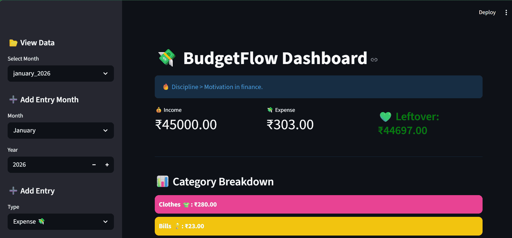
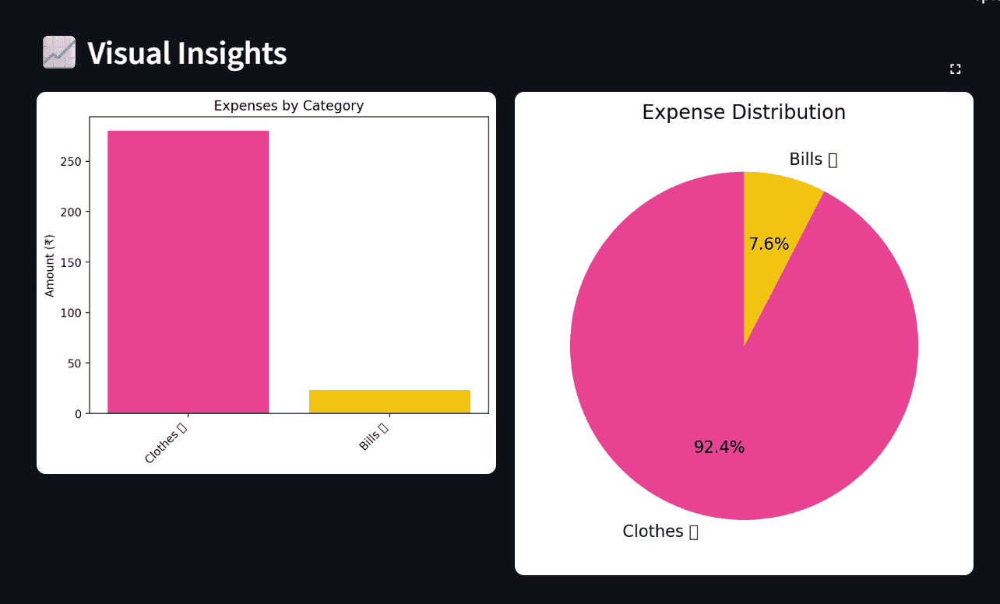
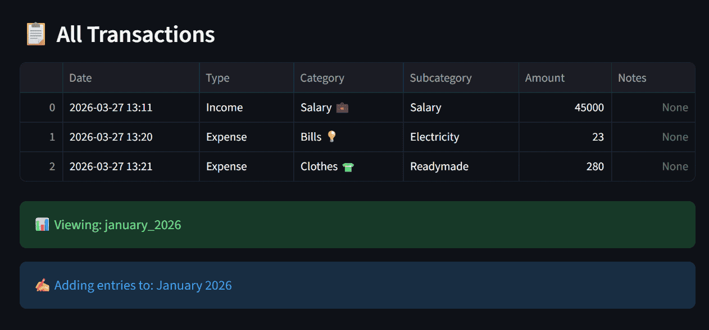

# 💸 BudgetFlow

A personal finance tracker built using **Python & Streamlit** to manage income, expenses, and monthly insights, designed for real-life usage.




---

## 🚀 Features

* 📂 **Month-wise tracking** (auto-organized in folders)
* ➕ Add entries for **any month & year**
* 💼 **Salary tracking (separate)** from expenses
* 🎨 **Color-coded categories** for better visualization
* 📊 Interactive **bar & pie charts**
* 🧾 CSV-based storage (simple, lightweight, future-proof)

---

## 🔐 Privacy & Usage

This project is intentionally designed to be:

* 🔒 **Local-first & private**: your financial data stays on your system
* 🚫 **Not deployed online**: no cloud storage, no external access
* 💻 Run entirely on your machine using Streamlit

👉 This ensures your data remains **secure and fully under your control**.

---

## 📊 What You Can Do

* 📈 Track and visualize **transactions** easily
* 📊 Analyze spending using **bar and pie charts**
* 🗂️ View exactly **which month/year entries belong to**
* ➕ Add new data or explore past records anytime

💡 The code is intentionally kept **very simple and beginner-friendly**.

* You can easily **modify, extend, or customize categories**
* Add your own labels and structure without complexity
* Use it directly via the **dashboard or by editing CSV files**

> ![NOTE]
> 👉 The goal was to make this so simple that even on your busiest or lowest-energy days, you can quickly log an expense without friction.

Honestly, the ability to create **custom categories and labels** was the main motivation behind building this, and you can fully make it your own too.

👉 All data is stored as **CSV files**, which means:

* You can reuse them later
* Import into Excel / Power BI / other tools
* Perform custom analysis anytime

---

## 🛠 Tech Stack

* Python
* Streamlit
* Pandas
* Matplotlib

---

## 📸 Screenshots

### 📊 Expense Visualization



### 📂 Monthly Tracking System



---

## ▶️ Run Locally

```bash
pip install -r requirements.txt
streamlit run budgetflow.py
```

---

## 📁 Project Structure

```
BudgetFlow/
│
├── budgetflow.py          # Main Streamlit app
├── requirements.txt       # Dependencies
├── README.md
│
├── snapshots/             # App screenshots
│   ├── app_1.png
│   ├── app_2.png
│   └── app_3.png
│
└── data/                  # Auto-generated data storage
    └── 2026/
        ├── january_2026.csv
        ├── february_2026.csv
        ├── march_2026.csv
        └── ...
```

---

## 💡 How It Works

* Each month’s data is stored in a **separate CSV file**
* Files are automatically organized by **year → month**
* You can:

  * 📊 View past data
  * ➕ Add entries to any selected month

👉 Clean structure ensures easy **analysis, tracking, and scalability**

---

## 🔮 Future Improvements

* 🎯 Budget limits per category
* 📅 Monthly comparison analytics
* ☁️ Optional cloud backup
* 📊 Yearly data consolidation (combining monthly CSVs into a single yearly file, currently exploring the best approach)

💡 I’m always open to **contributions, suggestions, and feedback** to improve this project further.
Future updates may include enhancements based on usability, performance, and data organization.

---

## 🙌 Motivation

Built to solve a real problem:

> *Tracking personal finances in a simple, private, and customizable way.*

---

## 👩‍💻 Author

**Madhurima Rawat**

### 📬 Connect With Me

If you’d like to discuss this project, collaborate, or need help using it:

* 📧 Email: **[rawatmadhurima4@gmail.com](mailto:rawatmadhurima4@gmail.com)**
* 💼 LinkedIn: **madhurima-rawat**

🌿 Feel free to reach out if something is not working or if you would like to build something similar. I would genuinely be happy to help!

> ⭐ If you found this useful, consider starring the repo!